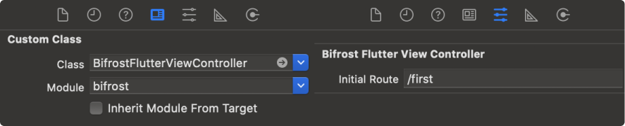

# Bifrost

Bifrost is a plugin which enables easy embedding of your Flutter application into your existing native apps.

## Requirements

- Flutter 2.0.0+ on stable channel
- iOS 10.0+ Xcode 12.0+ Swift 5+
- Android minSdkVersion 16 Kotlin 1.3.50+

## Getting Started

### Flutter

Add a dependency in your Flutter project

``` yaml
dependencies:
  bifrost: ^0.1.0
```

Initialize Bifrost on your MaterialApp or CupertinoApp

``` dart
@override
Widget build(BuildContext context) {
  return MaterialApp(
    builder: Bifrost.init(),
    routes: routes,
    theme: theme,
  );
}
```

Invoke a method of the native layer, from your Flutter code

``` dart
final appVersion = await BifrostChannels.common.invokeMethod('getAppVersion');
```

Send notification to native app
   
``` dart
BifrostChannels.notification.invokeMethod('doSomething', arguments);
```

### Android

Start Bifrost Flutter Engine in your application class and also add the common MethodCallHandler

``` kotlin
class App : Application() {

  override fun onCreate() {
    super.onCreate()
    // start flutter engine
    Bifrost.startFlutterEngine(this, CommonHandler())
  }

  // application common handler
  private class CommonHandler : MethodChannel.MethodCallHandler {
    override fun onMethodCall(call: MethodCall, result: MethodChannel.Result) {
      when (call.method) {
        "getAppVersion" -> result.success(BuildConfig.VERSION_NAME)
      }
    }
  }
}
```

Start a new activity by passing an initial route

``` kotlin
val intent = BifrostFlutterActivity.createIntent(this, "/greetings", arguments)
startActivity(intent)
```

Create a new fragment instance by passing an initial route

``` kotlin
val fragment = BifrostFlutterFragment.newInstance("/first")
```

Register notification listener

``` kotlin
Bifrost.registerNotification("doSomething") { arguments ->
  // do something
}
```

### iOS

Start Bifrost Flutter Engine in your AppDelegate and also add the common MethodCallHandler

``` swift
import UIKit
import bifrost

@UIApplicationMain
class AppDelegate: UIResponder, UIApplicationDelegate {
    
    var window: UIWindow?
    
    func application(
        _ application: UIApplication,
        didFinishLaunchingWithOptions launchOptions: [UIApplication.LaunchOptionsKey: Any]?) -> Bool {
 
        // start bifrost flutter engine
        Bifrost.startFlutterEngine(commonHandler: handle)
        
        return true
    }

    // common channel handle
    private func handle(_ call: FlutterMethodCall, result: @escaping FlutterResult) {
        if (call.method == "getAppVersion") {
            let version = Bundle.main.infoDictionary?["CFBundleShortVersionString"]
            result(version)
        }
    }
}

```

Start a new ViewController by passing an initial route

``` swift
let vc = BifrostFlutterViewController.init("/greetings", arguments: arguments)
```

If you want to use storyboard, you can use custom attributes



Register notification listener

``` swift
Bifrost.registerNotification("doSomething") { arguments in
  // do something          
}
```
